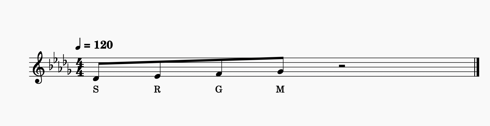

# 🎶 MIDI Generator For Music Learners

## Overview

**MIDI Generator For Music Learners** is a Python-based tool designed to help music students, especially those learning Indian Classical Music, practice and experiment with musical notes in a structured yet creative way. It allows users to create, manipulate, and explore melodies based on specific **Thaats** and custom note combinations.

Whether you're composing, practicing, or just exploring sound design, this tool offers unique ways to generate **MIDI files** from swaras (notes), random melodies, or even transform existing MIDI into different musical modes.

---

## ✨ Key Features

### 1. 🎼 **Custom Note to MIDI Generator**

- Think of any notes using Indian Classical notation such as:
  
  ```
  S, r, R, g, G, M, M', P, d, D, n, N, S
  ```
  - `r` = Komal Re (minor second)
  - `R` = Shuddha Re (major second)
  - You can also use `'rr'` as an alternate for Komal Re

- Create a plain text file with the notes:

  ```
  S R G M
  ```

  This will generate a MIDI file containing notes like `C# D# F F#`.

- Another example:

  ```
  S R g M
  ```

  Generates a MIDI with notes: `C# D# E F#`.

- ✅ Ideal for:
  - Quickly converting your musical thoughts into MIDI
  - Using the MIDI in platforms like **MainStage**, **Ableton Live**, **GarageBand**, or any DAW
  - Practicing pitch recognition and scale familiarity

---

### 2. 🔁 **MIDI Mode Converter (Thaat Mapper)**

- Already have a MIDI file in a **Western scale** (e.g., Major scale)?
- This tool can **re-map** the MIDI notes to one of the **10 Indian Thaats**:
  
  - Bilawal
  - Kafi
  - Khamaj
  - Bhairav
  - Bhairavi
  - Asavari
  - Todi
  - Marwa
  - Purvi
  - Yaman

- Convert a melody from **Major to Minor**, or from **Ionian to Dorian, Mixolydian, Phrygian**, etc.

- Gives you instant exploration of **emotions, colors, and moods** by switching the tonal center.

---

### 3. 🎲 **Random Melody Generator Based on Thaats**

- Specify a **Thaat** and the number of **measures** (e.g., 40)
- The program will generate a **random melody** that:
  - Follows the chosen Thaat strictly
  - Keeps the **1st (Sa)** and **5th (Pa)** notes fixed
  - Places other swaras randomly within the scale
- Great for:
  - Ear training
  - Improvisation practice
  - Getting a "feel" of a Thaat through randomized composition

---

## 📦 Installation

Clone this repository:

    ```bash
    git clone https://github.com/your-username/midi-generator.git
    cd midi-generator
    ```


---

## 🚀 Usage

### ✅ Generate MIDI from a text file of notes:

Create a file like `notes.txt`:

```text
S R G M
```

Then run:

```bash
python generate_midi.py notes.txt
```

This will create a MIDI file with the corresponding Western pitches.




---

### ✅ Set Tempo in your input:

```text
//Tempo//   1  1  1  1
//Notes//   S  R  G  M
```

```text
//Tempo//   1  2  1
//Notes//   S  R  M
```

---

### ✅ Convert Existing MIDI into a Different Thaat:

```bash
python convert_midi_thaat.py input.mid --thaat Bhairavi
```

---

### ✅ Generate Random Melody for a Thaat:

```bash
python generate_random_melody.py --thaat Marwa --measures 40
```

---

## 🔧 File Format (Input)

- Notes must be written using Indian swara notation.
- Tempo (in beats per note) can be adjusted using the `//Tempo//` line.

---

## 🧠 Why Use This?

- Practice Indian Classical Music digitally
- Experiment with sound using MIDI-compatible tools
- Train your ears to recognize Thaats and scales
- Get inspired by randomly generated melodies
- Use MIDI in production and performance environments

---

## 📝 Contributing

Feel free to fork the repository and open pull requests! Whether you're improving scale mappings, adding new features, or fixing bugs — your contributions are welcome.

---

## 📄 License

This project is licensed under the MIT License. See [LICENSE](LICENSE) for details.